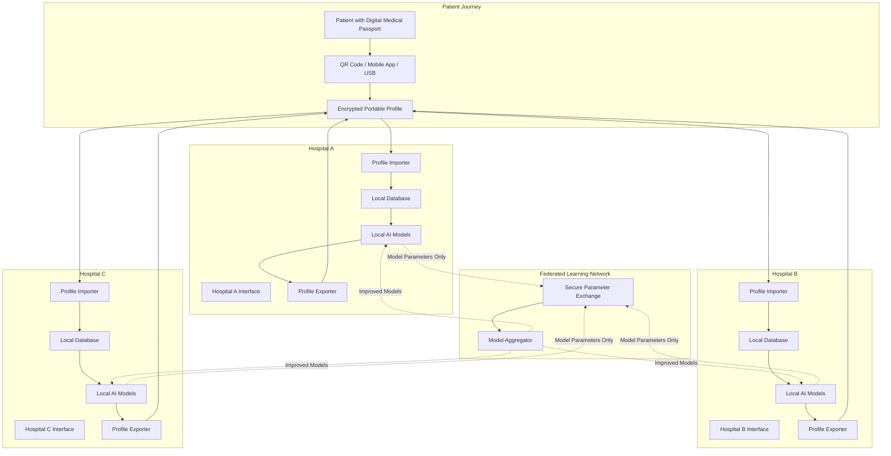
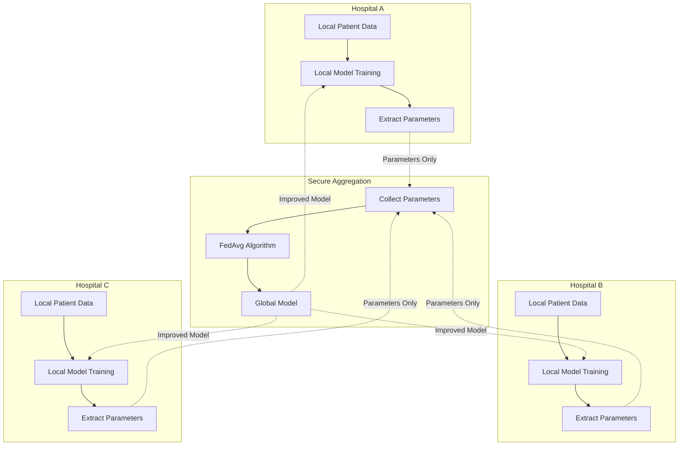
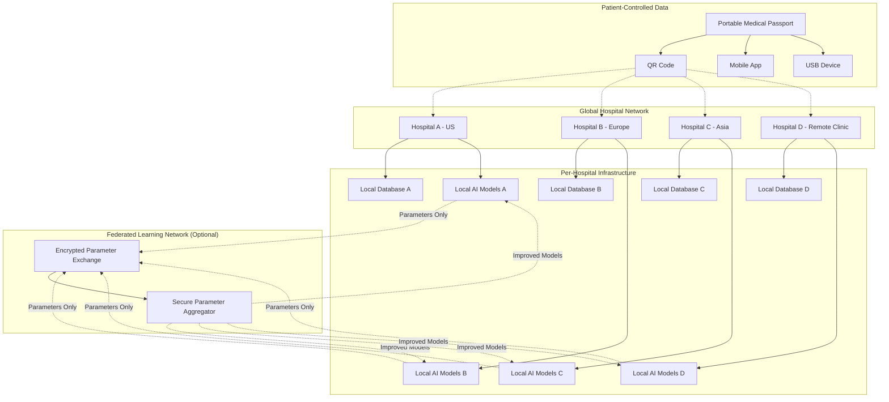

# Design Document - Medi OS Kiroween Edition v2.0

## Overview

**Medi OS Kiroween Edition v2.0** is a revolutionary patient-controlled, privacy-first medical records system that enables patients to carry their complete clinical history as portable "digital medical passports." The system empowers true care continuity by allowing any hospital worldwide to read, verify, and append to patient profiles without network dependencies or centralized record requests. Built with a federated learning architecture, the system enables AI improvement across all hospitals while maintaining absolute patient privacy and data sovereignty.

**Core Innovation**: Unlike traditional EHR systems that centralize patient data, Medi OS v2.0 puts patients in complete control of their medical information through tamper-evident, portable profiles that contain pure clinical data with zero hospital or provider identification.

## Revolutionary Architecture Principles

### Patient-Controlled Data Sovereignty
- **Portable Profiles**: Patients carry complete medical history as encrypted, signed digital passports
- **Zero Network Dependency**: Full functionality offline - no APIs, databases, or internet required
- **Append-Only Timeline**: Each hospital adds to patient history without overwriting previous entries
- **Privacy-First**: Pure clinical data only - no hospital names, provider names, or geographic metadata

### Federated Learning Without Data Sharing
- **Local AI Training**: Each hospital trains triage/summarization models on local data only
- **Parameter Sharing**: Only model weights/gradients shared, never patient data
- **Global Improvement**: All hospitals benefit from collective learning while maintaining privacy
- **Secure Aggregation**: Cryptographically secure model parameter combination

### Universal Hospital Compatibility
- **Vendor Agnostic**: Works with any hospital infrastructure worldwide
- **Standardized Interface**: Identical workflows across all hospital implementations
- **Offline Resilience**: Full functionality during network outages or remote locations
- **Tamper Evidence**: Cryptographic signatures ensure profile authenticity

## Architecture

### System Architecture - Federated Hospital Network



### Technology Stack

**Per-Hospital Backend**: FastAPI (Python 3.11+)
- **Local Database**: PostgreSQL per hospital (no centralization)
- **Profile Processing**: FHIR Bundle + JSON + Cryptographic signing
- **AI Integration**: Google Gemini 1.5 Pro, OpenAI Whisper (local instances)
- **Authentication**: JWT with role-based access control
- **Offline Capability**: Full functionality without network connectivity

**Portable Profile Format**:
- **Structure**: FHIR Bundle or secure JSON with cryptographic signatures
- **Encryption**: AES-256 encryption with patient-controlled keys
- **Transport**: QR codes, mobile apps, USB devices, encrypted files
- **Verification**: Hash chains and digital signatures for tamper evidence

**Frontend Framework**: React 18 + TypeScript
- **Build Tool**: Vite for fast development and offline PWA capability
- **State Management**: TanStack Query + Zustand for offline-first data
- **UI Components**: Material-UI + Tailwind CSS for consistent hospital interfaces
- **Offline Support**: Service workers for full offline functionality

**Federated Learning Stack**:
- **Local Training**: PyTorch/TensorFlow for hospital-specific model training
- **Parameter Aggregation**: FedAvg algorithm with secure multi-party computation
- **Communication**: Encrypted parameter exchange (no patient data)
- **Model Types**: Triage classification, clinical summarization, diagnostic support

## Components and Interfaces

### 1. Digital Medical Passport Service

**Purpose**: Create, import, verify, and export patient-controlled portable profiles

**Key Components**:
- `PassportCreator`: Generates new MED-{uuid4} patient identities with initial profiles
- `PassportImporter`: Reads and verifies portable profiles from QR/file/app
- `PassportExporter`: Creates updated portable profiles with new clinical data
- `CryptographicVerifier`: Validates profile signatures and detects tampering
- `PrivacyFilter`: Ensures zero hospital/provider metadata in exported profiles

**API Interface**:
```python
class DigitalMedicalPassportService:
    def create_new_passport(demographics: PatientDemographics) -> PortableProfile
    def import_passport(encrypted_data: bytes, verification_key: str) -> PatientProfile
    def export_passport(patient_id: str, format: ExportFormat) -> EncryptedProfile
    def verify_passport_integrity(profile: PortableProfile) -> VerificationResult
    def append_clinical_event(patient_id: str, event: ClinicalEvent) -> None
```

### 2. Hospital Profile Integration Service

**Purpose**: Seamlessly merge imported profiles with local hospital systems

**Key Components**:
- `ProfileMerger`: Combines imported timeline with local patient database
- `LocalDataManager`: Manages hospital-specific patient records (full fidelity)
- `TimelineAppender`: Adds new clinical events to imported timelines
- `ConflictResolver`: Handles data conflicts between imported and local records
- `AuditLogger`: Tracks all profile access and modifications for compliance

**API Interface**:
```python
class HospitalIntegrationService:
    def merge_imported_profile(profile: PortableProfile) -> LocalPatientRecord
    def append_local_events(patient_id: str, events: List[ClinicalEvent]) -> None
    def resolve_data_conflicts(imported: PatientData, local: PatientData) -> ResolvedData
    def create_audit_entry(action: str, user_id: str, patient_id: str) -> AuditEntry
    def prepare_export_profile(patient_id: str) -> PortableProfile
```

### 3. Federated Learning Orchestrator

**Purpose**: Enable AI improvement across hospitals without sharing patient data

**Key Components**:
- `LocalModelTrainer`: Trains triage/summarization models on hospital-specific data
- `ParameterExtractor`: Extracts model weights/gradients for federated sharing
- `SecureAggregator`: Combines model parameters from multiple hospitals using FedAvg
- `ModelUpdater`: Integrates improved global models back into local systems
- `PrivacyValidator`: Ensures no patient data is included in federated exchanges

**Federated Learning Workflow**:


**API Interface**:
```python
class FederatedLearningService:
    def train_local_model(data_source: str, model_type: str) -> LocalModel
    def extract_parameters(model: LocalModel) -> ModelParameters
    def submit_to_federation(parameters: ModelParameters) -> SubmissionResult
    def receive_global_update() -> GlobalModelParameters
    def integrate_global_model(global_params: GlobalModelParameters) -> UpdatedModel
```

### 4. Append-Only Clinical Timeline Service

**Purpose**: Maintain complete chronological medical history across all hospitals

**Timeline Structure (Privacy-Filtered)**:
```json
{
  "patient_id": "MED-550e8400-e29b-41d4-a716-446655440000",
  "created_at": "2024-01-15T10:30:00Z",
  "last_updated": "2024-11-15T14:22:00Z",
  "timeline_entries": [
    {
      "entry_id": "entry-001",
      "timestamp": "2024-01-15T10:30:00Z",
      "event_type": "clinical_visit",
      "clinical_content": "Patient presented with chest pain, shortness of breath...",
      "structured_data": {
        "symptoms": ["chest pain", "dyspnea"],
        "medications_prescribed": ["aspirin 81mg daily"],
        "allergies_noted": ["penicillin"],
        "vital_signs": {"hr": 88, "bp": "120/80", "temp": 98.6}
      },
      "ai_summary": "Cardiac evaluation with normal ECG, started on aspirin...",
      "confidence_score": 0.95,
      "cryptographic_signature": "sha256:abc123...",
      "hospital_metadata": null,
      "provider_metadata": null,
      "location_metadata": null
    }
  ],
  "profile_integrity_hash": "sha256:def456..."
}
```

**API Interface**:
```python
class ClinicalTimelineService:
    def append_clinical_event(patient_id: str, event: ClinicalEvent) -> TimelineEntry
    def get_complete_timeline(patient_id: str) -> ClinicalTimeline
    def search_clinical_history(patient_id: str, query: ClinicalQuery) -> List[TimelineEntry]
    def verify_timeline_integrity(timeline: ClinicalTimeline) -> IntegrityResult
    def export_timeline_for_transport(patient_id: str) -> PortableTimeline
```

## Data Models

### Portable Profile Models (Patient-Controlled)

```python
class PortableProfile(BaseModel):
    """Complete patient-controlled medical passport"""
    patient_id: str  # Format: MED-{uuid4} - universal identifier
    profile_version: str  # Semantic versioning for profile format
    created_at: datetime
    last_updated: datetime
    
    # Patient Demographics (minimal for privacy)
    demographics: PatientDemographics
    
    # Complete Clinical Timeline (append-only)
    clinical_timeline: List[ClinicalEvent]
    
    # Current Medical Status
    active_medications: List[Medication]
    known_allergies: List[Allergy]
    chronic_conditions: List[MedicalCondition]
    
    # Profile Integrity & Security
    cryptographic_signatures: List[ProfileSignature]
    integrity_hash: str
    
    # Privacy Guarantee: Zero hospital/provider/location metadata

class ClinicalEvent(BaseModel):
    """Individual clinical event in patient timeline"""
    event_id: str
    timestamp: datetime
    event_type: ClinicalEventType  # visit, procedure, diagnosis, medication, lab, etc.
    
    # Pure Clinical Content
    clinical_summary: str
    structured_data: Dict[str, Any]  # Medications, vitals, lab values, etc.
    ai_generated_insights: Optional[str]
    confidence_score: Optional[float]
    
    # Tamper Evidence (no institutional identification)
    cryptographic_signature: str
    signing_timestamp: datetime
    
    # Privacy: Absolutely no hospital/provider/location data

class PatientDemographics(BaseModel):
    """Minimal demographics for privacy"""
    first_name: Optional[str]  # Patient can choose to include/exclude
    last_name: Optional[str]   # Patient can choose to include/exclude
    date_of_birth: Optional[date]
    biological_sex: Optional[str]
    emergency_contact: Optional[EmergencyContact]
    
    # Privacy: No addresses, phone numbers, or identifying information
```

### Hospital-Local Models (Full Fidelity)

```python
class LocalPatientRecord(BaseModel):
    """Full hospital record with complete metadata (stays local)"""
    local_patient_id: str  # Hospital-specific ID
    portable_patient_id: str  # Links to MED-{uuid4}
    
    # Full Hospital Context (never exported)
    hospital_id: str
    attending_physicians: List[str]
    admission_details: AdmissionRecord
    billing_information: BillingRecord
    insurance_details: InsuranceRecord
    
    # Complete Clinical Data (full fidelity)
    detailed_clinical_notes: List[ClinicalNote]
    complete_lab_results: List[LabResult]
    imaging_studies: List[ImagingStudy]
    procedure_reports: List[ProcedureReport]
    
    # Links to Portable Profile
    last_profile_import: datetime
    last_profile_export: datetime
    profile_sync_status: ProfileSyncStatus

class FederatedLearningModels(BaseModel):
    """AI models that improve through federated learning"""
    triage_model: TriageModel
    summarization_model: SummarizationModel
    diagnostic_support_model: DiagnosticModel
    
    # Federated Learning Metadata
    model_version: str
    last_federated_update: datetime
    local_training_cycles: int
    global_accuracy_metrics: Dict[str, float]
    
    # Privacy: No patient data, only model parameters

class ProfileSignature(BaseModel):
    """Cryptographic signature for tamper evidence"""
    signature_id: str
    signing_algorithm: str  # e.g., "RSA-SHA256"
    signature_value: str
    signing_timestamp: datetime
    
    # Verifiable but not identifiable
    public_key_fingerprint: str  # For verification without revealing institution
```

### Export/Import Models

```python
class ProfileExportRequest(BaseModel):
    """Request to export updated patient profile"""
    patient_id: str
    export_format: ExportFormat  # QR, JSON, FHIR, encrypted_file
    include_full_timeline: bool = True
    privacy_level: PrivacyLevel  # minimal, standard, comprehensive
    
class ProfileImportResult(BaseModel):
    """Result of importing patient profile"""
    import_success: bool
    patient_id: str
    timeline_entries_imported: int
    data_conflicts_detected: List[DataConflict]
    verification_status: VerificationStatus
    
class DataConflict(BaseModel):
    """Conflict between imported and local data"""
    conflict_type: str  # "medication_mismatch", "allergy_difference", etc.
    imported_value: Any
    local_value: Any
    resolution_strategy: str
    requires_manual_review: bool

class ExportFormat(str, Enum):
    QR_CODE = "qr_code"
    ENCRYPTED_JSON = "encrypted_json"
    FHIR_BUNDLE = "fhir_bundle"
    MOBILE_APP = "mobile_app"
    USB_DEVICE = "usb_device"

class PrivacyLevel(str, Enum):
    MINIMAL = "minimal"      # Only critical medical info
    STANDARD = "standard"    # Standard clinical data
    COMPREHENSIVE = "comprehensive"  # Full timeline with AI insights
```

## Error Handling & Resilience

### Offline-First Design Strategy

**Network Connectivity Issues**:
- Full functionality maintained offline - no degradation
- Profile import/export works without internet connectivity
- Local AI models continue operating independently
- Queue federated learning updates for when connectivity returns

**Profile Import/Export Failures**:
- Graceful handling of corrupted or tampered profiles
- Clear error messages for verification failures
- Fallback to manual data entry if profile import fails
- Automatic retry mechanisms for export operations

**Cryptographic Verification Issues**:
- Clear indication when profiles cannot be verified
- Option to proceed with unverified data (with warnings)
- Detailed logging of verification failures for security analysis
- Fallback to basic profile creation if verification systems fail

### Error Response Format

```python
class MediOSError(BaseModel):
    success: bool = False
    error_code: str
    error_message: str
    error_category: ErrorCategory
    patient_safety_impact: SafetyImpact
    recommended_action: str
    fallback_available: bool
    offline_capability_affected: bool

class ErrorCategory(str, Enum):
    PROFILE_IMPORT = "profile_import"
    PROFILE_EXPORT = "profile_export"
    CRYPTOGRAPHIC_VERIFICATION = "crypto_verification"
    FEDERATED_LEARNING = "federated_learning"
    CLINICAL_DATA_INTEGRITY = "clinical_data"

class SafetyImpact(str, Enum):
    NONE = "none"           # No impact on patient care
    LOW = "low"             # Minor workflow disruption
    MEDIUM = "medium"       # Requires manual intervention
    HIGH = "high"           # Potential patient safety concern
    CRITICAL = "critical"   # Immediate attention required
```

## Testing Strategy

### Core Functionality Testing
- **Profile Import/Export**: Test all export formats (QR, JSON, FHIR, mobile app)
- **Cryptographic Verification**: Test signature validation and tamper detection
- **Timeline Integrity**: Test append-only operations and data preservation
- **Privacy Filtering**: Verify complete removal of hospital/provider metadata
- **Offline Functionality**: Test full system operation without network connectivity

### Cross-Hospital Workflow Testing
- **Multi-Hospital Journey**: Patient profile travels through 3+ hospitals
- **Timeline Continuity**: Verify complete medical history preservation
- **Data Conflict Resolution**: Test handling of conflicting medical information
- **Emergency Scenarios**: Test profile access during critical care situations

### Federated Learning Testing
- **Parameter Extraction**: Verify only model weights are shared, never patient data
- **Model Aggregation**: Test FedAvg algorithm with multiple hospital models
- **Privacy Preservation**: Ensure no patient information leaks through model parameters
- **Accuracy Improvement**: Verify global models outperform local-only training

### Security & Privacy Testing
- **Cryptographic Integrity**: Test profile tampering detection
- **Privacy Compliance**: Verify zero hospital metadata in exported profiles
- **Access Control**: Test role-based permissions across hospital systems
- **Audit Logging**: Verify complete audit trails without PHI exposure

### Demo Scenarios for Kiroween 2025

**Scenario 1: Global Medical Tourism**
- Patient with cardiac history visits Hospital A (US), Hospital B (Europe), Hospital C (Asia)
- Each hospital imports profile, provides care, appends new events
- Demonstrate complete care continuity without network dependencies
- Verify privacy: no hospital names visible in patient timeline

**Scenario 2: Emergency Care with Portable Profile**
- Unconscious patient arrives with QR code medical passport
- Emergency team scans QR, instantly accesses critical allergies and medications
- Provides life-saving care based on complete medical history
- Updates profile with emergency treatment before patient transfer

**Scenario 3: Federated AI Improvement**
- 3 hospitals train triage models on local data
- Models share parameters (no patient data) through secure aggregation
- Demonstrate improved triage accuracy across all hospitals
- Show privacy preservation: no patient information in federated exchange

### Test Data Requirements
- **Synthetic Patients**: 10-15 patients with rich multi-hospital histories spanning 5+ years
- **Medical Scenarios**: Cardiac, diabetes, cancer, emergency trauma, chronic conditions
- **Profile Formats**: QR codes, encrypted JSON, FHIR bundles, mobile app data
- **Federated Models**: Pre-trained triage and summarization models for demonstration

## Security & Privacy Architecture

### Patient-Controlled Privacy Design
- **Zero Hospital Metadata**: Absolute guarantee that no hospital, provider, or location data appears in portable profiles
- **Patient Ownership**: Patients maintain complete control over their medical data
- **Selective Sharing**: Patients choose what information to include in profiles
- **Revocable Access**: Patients can revoke hospital access to their data at any time

### Cryptographic Security Framework
- **Profile Signing**: Each clinical event cryptographically signed for tamper evidence
- **Hash Chaining**: Timeline entries linked through cryptographic hashes
- **Verification Without Identity**: Signatures verifiable without revealing signing institution
- **Encryption at Rest**: All portable profiles encrypted with patient-controlled keys

### Federated Learning Privacy Guarantees
- **Differential Privacy**: Model parameters include noise to prevent data reconstruction
- **Secure Aggregation**: Multi-party computation prevents individual hospital model inspection
- **Parameter-Only Sharing**: Absolute guarantee that no patient data leaves hospital premises
- **Audit Verification**: Cryptographic proofs that only model parameters were shared

### Compliance & Audit Framework
- **HIPAA Compliance**: Full compliance with patient data protection requirements
- **GDPR Compliance**: Patient right to data portability and erasure
- **Audit Trails**: Complete logging of all profile access and modifications
- **Breach Detection**: Automated monitoring for unauthorized access attempts
- **International Standards**: Compliance with global healthcare data protection regulations

### Emergency Access Protocols
- **Break-Glass Access**: Emergency override for critical patient care
- **Audit Logging**: All emergency access fully logged and reviewed
- **Patient Notification**: Patients notified of all emergency access events
- **Minimal Data Exposure**: Emergency access limited to critical medical information only

## Deployment Architecture

### Distributed Hospital Network



### Per-Hospital Infrastructure Requirements
- **Local Database**: PostgreSQL instance per hospital (no centralization)
- **Local Storage**: Hospital-specific file storage for full-fidelity records
- **Local AI**: Hospital-trained models for triage and summarization
- **Offline Capability**: Full functionality without internet connectivity
- **Security**: End-to-end encryption and cryptographic verification

### Federated Learning Infrastructure (Optional)
- **Secure Aggregator**: Collects and combines model parameters only
- **Encrypted Transport**: All federated communication encrypted and authenticated
- **Privacy Validation**: Cryptographic proofs that no patient data is shared
- **Decentralized**: No single point of failure or control

### Kiroween 2025 Demo Deployment

**Demo Infrastructure**:
- 3 simulated hospitals (Hospital A, B, C) on separate cloud instances
- 10-15 synthetic patients with rich multi-hospital histories
- Federated learning aggregator for AI improvement demonstration
- Mobile app simulator for patient profile management

**Demo Scenarios**:
1. **Global Medical Tourism**: Patient travels between 3 hospitals across continents
2. **Emergency Care**: Unconscious patient with QR code medical passport
3. **Federated AI**: Demonstrate AI improvement without data sharing
4. **Privacy Verification**: Show zero hospital metadata in patient profiles

**Technical Setup**:
- Docker containers for each hospital instance
- Kubernetes orchestration for scalability demonstration
- Cloud deployment (Google Cloud Run) for global accessibility
- Mobile-responsive web interface for cross-device compatibility

### Production Scalability Considerations

**Global Scale**:
- Support for 1000+ hospitals worldwide
- Millions of patient profiles with complete medical histories
- Real-time federated learning across global hospital network
- Multi-language support for international deployment

**Enterprise Features**:
- Advanced audit and compliance reporting
- Integration with existing hospital information systems
- Enterprise-grade security and monitoring
- 24/7 support and maintenance capabilities

## Development Tools

### Kiro IDE Integration

This project leverages Kiro IDE for hackathon development:

**Spec-Driven Development**:
- All components developed using Kiro specs in `.kiro/specs/portable-patient-profiles/`
- Requirements → Design → Tasks workflow for systematic implementation
- Iterative refinement with user feedback at each stage

**Agent Hooks for Automated Testing**:
- Pre-commit hooks for medical safety validation
- Automated triage model accuracy testing
- Patient data privacy compliance checks
- Cross-hospital workflow validation

**Steering Documents for Medical Safety Patterns**:
- `.kiro/steering/medical-safety.md` - Clinical data handling guidelines
- `.kiro/steering/privacy-patterns.md` - Patient privacy protection rules
- `.kiro/steering/triage-validation.md` - ESI level validation patterns

**MCP Integration for Healthcare Standards**:
- FHIR (Fast Healthcare Interoperability Resources) compliance
- ICD-10 diagnostic code validation
- HL7 message format processing
- Medical terminology standardization

**Hackathon Development Benefits**:
- Rapid prototyping with spec-driven approach
- Automated quality assurance for medical applications
- Consistent development patterns across team members
- Built-in documentation generation for judges

This design provides a robust foundation for building the portable patient operating system while maintaining the flexibility to scale across multiple hospitals and handle the complex requirements of healthcare data management.